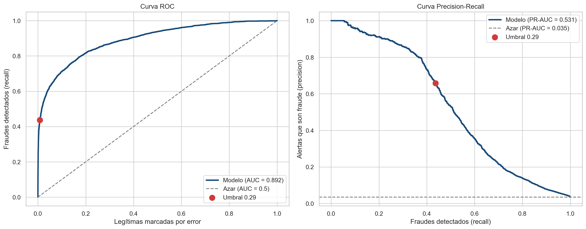
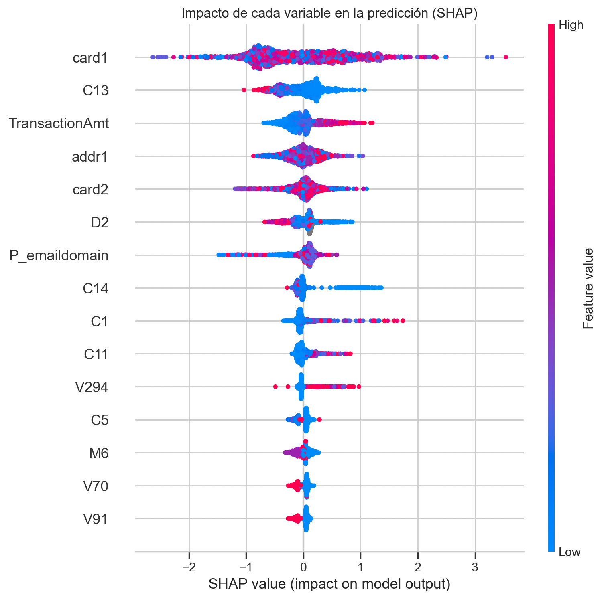

# Detección de Fraude en Transacciones Bancarias

Proyecto Final — Módulo 7, Diplomado en Machine Learning y Deep Learning Aplicado (FIUNA).

## Problema

El fraude en transacciones con tarjeta genera pérdidas a bancos y clientes. Detectarlo es difícil porque las transacciones fraudulentas son muy pocas frente a las legítimas, y un sistema que marca demasiadas alertas falsas molesta a los clientes.

## Objetivo

Entrenar un modelo de clasificación que estime la probabilidad de que una transacción sea fraudulenta, evaluado de la misma forma en que se usaría en la realidad: entrenado con transacciones pasadas y medido sobre transacciones futuras.

## Datos

[IEEE-CIS Fraud Detection](https://www.kaggle.com/c/ieee-fraud-detection) (Kaggle), transacciones reales de e-commerce provistas por Vesta Corporation.

- 590.540 transacciones y 394 columnas (tabla `train_transaction.csv`).
- 3.5% de fraude.
- 182 días de datos.
- No se usó la tabla `identity`: solo el 24% de las transacciones la tiene.

### Cómo llegamos a este dataset

1. **Primer intento.** Empezamos con [Bank Transaction Fraud Detection](https://www.kaggle.com/datasets/marusagar/bank-transaction-fraud-detection) (Kaggle, 200.000 transacciones), que además usaba un [paper publicado](https://www.sciencedirect.com/science/article/pii/S1059056026000298) sobre detección de fraude con TabNet.
2. **Problema con los datos.** En el análisis exploratorio, ninguna variable mostró relación con el fraude. La tasa de fraude era de ~5% en todas las categorías (comercio, tipo de transacción, dispositivo), y el monto promedio era casi idéntico entre transacciones legítimas y fraudulentas. Todo indicaba que la etiqueta se había asignado al azar.
3. **Problema con el paper.** El paper reportaba 97% de accuracy con TabNet. Pero sus otros cuatro modelos (DNN, CNN, GRU, LSTM) daban un ROC-AUC de ~0.5, equivalente a adivinar al azar. Además, aplicaba SMOTE antes de separar entrenamiento y validación. Eso genera una fuga de datos, y probablemente explica el resultado de TabNet.
4. **Cambio.** Pasamos a IEEE-CIS: son transacciones reales de una empresa de pagos, con señal verificable en el análisis exploratorio.

## Modelo

Un `Pipeline` de scikit-learn que recibe una transacción cruda y devuelve la probabilidad de fraude:

```
Pipeline
├── preprocesamiento: ColumnTransformer
│   ├── categóricas (ProductCD, card4, M1...)  → OrdinalEncoder
│   ├── TransactionDT                          → FunctionTransformer (hora del día)
│   ├── columnas donde falta el dato con señal → MissingIndicator (0/1)
│   └── resto de numéricas                     → sin cambios
└── modelo: LGBMClassifier
```

- **LightGBM**, porque maneja valores nulos por su cuenta y rinde bien en datos tabulares.
- **Split temporal**: 70% de días más antiguos para entrenar, 15% siguiente para validación (early stopping y umbral), 15% más reciente para test.
- **Selección de flags solo con train**: las columnas que reciben `MissingIndicator` se eligen por su correlación con el fraude en entrenamiento.
- **Sin SMOTE ni pesos de clase**: compensar el desbalance con `is_unbalance=True` empeoró el resultado en validación, así que se entrenó sobre la distribución natural.
- **Umbral de decisión** elegido en validación (máximo F1) en lugar del 0.5 por defecto.

Las funciones auxiliares del pipeline están en `fraude_utils.py`, para que `model.pkl` se pueda cargar desde la app.

### Por qué un split temporal

En un experimento complementario (no incluido en el notebook) se entrenó el mismo modelo con tres formas de separar los datos:

| Split | ROC-AUC test | PR-AUC test |
|---|---|---|
| Aleatorio | 0.971 | 0.845 |
| **Temporal (usado)** | **0.892** | **0.533** |
| Aleatorio agrupado por cliente | 0.867 | 0.487 |

El split aleatorio da métricas mucho más altas porque transacciones de un mismo cliente quedan en train y en test, y el modelo las reconoce. Cuando se agrupa por cliente (usando la aproximación `card1 + addr1 + (día − D1)`), ese efecto desaparece. El split temporal refleja el uso real: predecir transacciones futuras, en su mayoría de clientes ya conocidos.

## Resultado

Métricas sobre el set de test, que no se usó para entrenar ni para ajustar nada:

| Métrica | Valor |
|---|---|
| ROC-AUC | 0.892 |
| PR-AUC | 0.531 |
| Precision (fraude) | 0.66 |
| Recall (fraude) | 0.44 |
| F1 (fraude) | 0.53 |

El modelo detecta el 44% de los fraudes, y el 66% de sus alertas son fraudes reales. El PR-AUC de 0.53 es unas 15 veces mejor que el de un modelo al azar (0.035, la tasa de fraude).

En monto, detecta el 31.5% de los dólares defraudados: atrapa mejor los fraudes chicos que los grandes.



El punto rojo es el umbral elegido (0.29): detecta el 44% de los fraudes marcando menos del 1% de las transacciones legítimas.

Es un buen punto de partida, no un modelo listo para producción.

### Explicabilidad con SHAP



Calculado con `TreeExplainer` sobre 2.000 transacciones de test. Cada punto es una transacción: a la derecha empuja la predicción hacia fraude; rojo es un valor alto de la variable y azul, bajo.

- `card1`, un identificador de la tarjeta, es la variable que más pesa. El modelo se apoya en reconocer tarjetas conocidas, lo mismo que mostró la comparación de splits.
- Los montos altos (`TransactionAmt`) empujan hacia fraude.
- `C13`, `C14` y `D2` también pesan, pero Vesta no publicó su significado exacto: SHAP dice cuáles importan, no siempre qué representan.
- En las variables categóricas (`card1`, `addr1`, `P_emaildomain`) el color no tiene significado: son códigos del `OrdinalEncoder`.

### ROI estimado

Calculado con las predicciones reales sobre test (30 días), con un modelo simple:

- **Beneficio**: el monto de los fraudes detectados, USD 144.270 por mes, suponiendo que se recupera el 100%. Es un supuesto optimista: en la práctica, parte del dinero puede moverse antes de que se bloquee la tarjeta.
- **Costo**: revisar cada una de las 1.987 alertas del mes, incluidas las falsas alarmas.

ROI = (beneficio − costo) / costo.

| Escenario | Costo por alerta | Costo mensual | Ganancia neta mensual | ROI |
|---|---|---|---|---|
| Pesimista | USD 10 | USD 19.870 | USD 124.400 | 6.3x |
| Base | USD 5 | USD 9.935 | USD 134.336 | 13.5x |
| Optimista | USD 3 | USD 5.961 | USD 138.310 | 23.2x |

**Punto de equilibrio:** cada alerta evita en promedio USD 72.6 de fraude (144.270 ÷ 1.987). El modelo es rentable mientras revisar una alerta cueste menos que eso.

Los supuestos no son datos de un banco real, y el dataset es una muestra de las transacciones de Vesta: el valor está en la estructura del cálculo, no en el número exacto.

## Próximos pasos

1. **Comparar con otros modelos**: regresión logística como línea base simple, Random Forest y XGBoost, usando el mismo split temporal.
2. **Optimizar hiperparámetros** de LightGBM con `RandomizedSearchCV`, eligiendo siempre en validación.
3. **Validar con varios cortes temporales** (`TimeSeriesSplit`), para saber cuánto varían las métricas y no depender de un solo corte.
4. **Agregar variables históricas por cliente**: gasto promedio, cantidad de transacciones previas y cuánto se aleja cada compra de lo habitual, calculadas solo con información anterior a cada transacción.
5. **Incorporar la tabla `identity`**: datos del dispositivo y la sesión para el 24% de transacciones que los tienen.
6. **Elegir el umbral según el costo**: en vez de maximizar F1, usar cuánto cuesta un fraude no detectado contra cuánto cuesta revisar una alerta falsa.

## Cómo ejecutar

Versiones exactas en `requirements.txt` (Python 3.11):

```bash
conda create -n diplomado-mldl python=3.11
conda activate diplomado-mldl
pip install -r requirements.txt
python -m ipykernel install --user --name diplomado-mldl --display-name "Python (diplomado-mldl)"
```

### Notebook

1. Descargar `train_transaction.csv` de la competencia en Kaggle y ubicarlo en `dataset/ieee-cis/train_transaction.csv`.
2. Abrir `notebooks/notebook_final.ipynb` con el kernel "Python (diplomado-mldl)".
3. Ejecutar todas las celdas de arriba a abajo. Genera `model.pkl`, `datos_muestra.csv` y las figuras de `figuras/`.

### App de Streamlit

```bash
./run_app.sh
```

El script crea el entorno conda si no existe, instala las dependencias y abre la app en `http://localhost:8501`. No necesita el dataset completo: solo `model.pkl` y `datos_muestra.csv`.

La app tiene dos pestañas:
- **Transacción individual**: elegir una transacción real del período de test, modificar monto, producto o tarjeta, y ver la probabilidad de fraude junto con la etiqueta real.
- **Lote desde CSV**: subir un archivo con transacciones y descargar las predicciones.

`datos_muestra.csv` tiene 100 transacciones del período de test: 20 fraudes y 80 legítimas, para que la demo muestre ambos casos. No respeta la proporción real de fraude (3.5%).

## Estructura

```
README.md
requirements.txt
run_app.sh                       # levanta la app de Streamlit
app.py                           # app de Streamlit
fraude_utils.py                  # funciones del pipeline de preprocesamiento
notebooks/notebook_final.ipynb   # EDA, pipeline, modelo, evaluación, SHAP y ROI
model.pkl                        # pipeline entrenado + umbral de decisión
datos_muestra.csv                # 100 transacciones del período de test
figuras/                         # curvas de evaluación y gráfico SHAP
```
